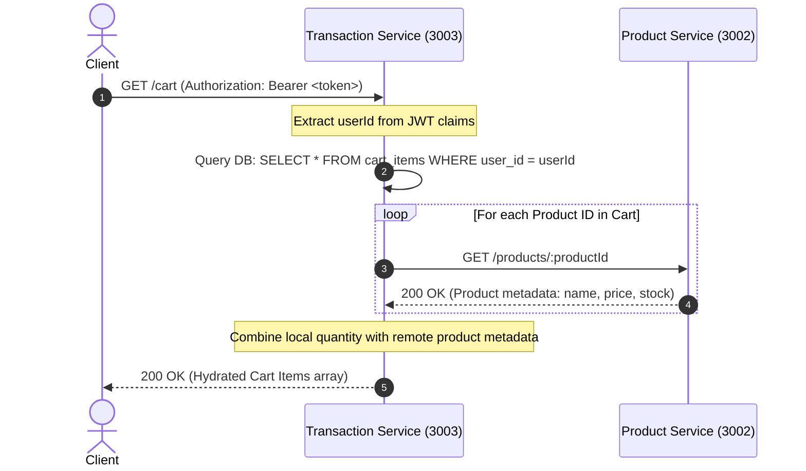
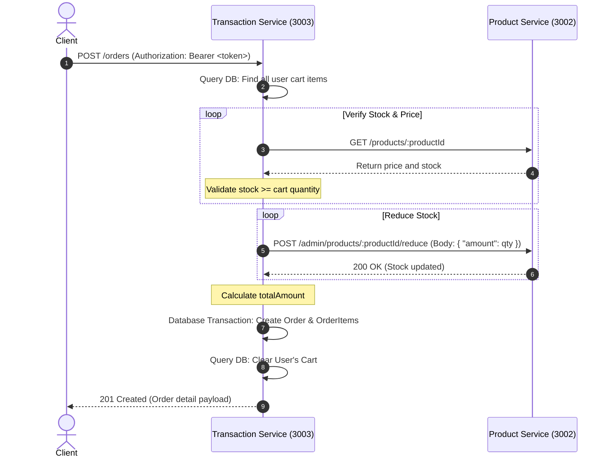
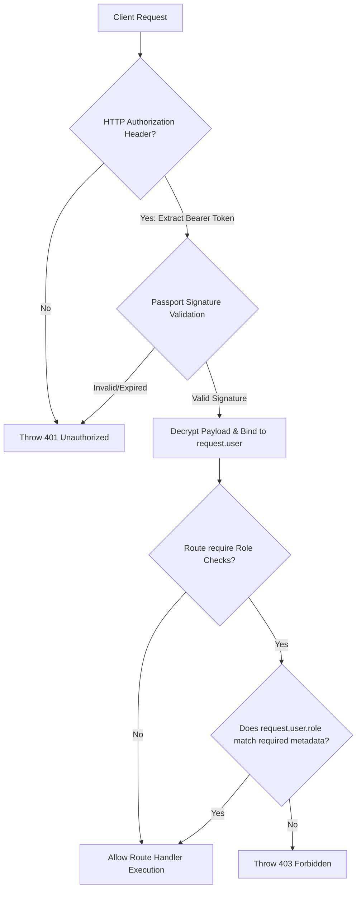

# DESIGN.md

This document outlines the detailed system design, structural folder organization, database blueprints, isolated Prisma ORM schemas, inter-service communications, and authentication protocols for the Jomoro Koffee application suite.

---

## 1. Directory Structure and Repository Boundaries

The project root consists of three completely independent NestJS codebases. Each service is tracked in its own GitHub repository.

```text
/project-sa/
│
├── .gitignore                   # Root level git ignore for non-service local IDE config
├── init.sql                     # Central database initialization script (MySQL)
│
├── auth-service/                # Service 1 Root (Port 3001)
│   ├── .git/                    # Independent Git repository boundary
│   ├── .gitignore               # Service-specific Git exclusion settings
│   ├── package.json             # Service-specific dependencies
│   ├── tsconfig.json            # TypeScript build rules
│   ├── prisma/
│   │   └── schema.prisma        # Context-isolated Prisma configuration (User table only)
│   └── src/
│       ├── main.ts              # App bootstrap, CORS setup, and Swagger config
│       ├── app.module.ts        # Module registration
│       ├── auth/
│       │   ├── auth.module.ts
│       │   ├── auth.controller.ts
│       │   ├── auth.service.ts
│       │   ├── guards/
│       │   │   ├── jwt-auth.guard.ts
│       │   │   └── roles.guard.ts
│       │   └── strategies/
│       │       └── jwt.strategy.ts
│       └── profiles/
│           ├── profiles.module.ts
│           ├── profiles.controller.ts
│           └── profiles.service.ts
│
├── product-service/             # Service 2 Root (Port 3002)
│   ├── .git/                    # Independent Git repository boundary
│   ├── .gitignore
│   ├── package.json
│   ├── tsconfig.json
│   ├── prisma/
│   │   └── schema.prisma        # Context-isolated Prisma configuration (Product & Category tables)
│   └── src/
│       ├── main.ts              # App bootstrap, CORS setup, and Swagger config
│       ├── app.module.ts
│       ├── categories/
│       │   ├── categories.module.ts
│       │   ├── categories.controller.ts
│       │   └── categories.service.ts
│       └── products/
│           ├── products.module.ts
│           ├── products.controller.ts
│           └── products.service.ts
│
└── transaction-service/         # Service 3 Root (Port 3003)
    ├── .git/                    # Independent Git repository boundary
    ├── .gitignore
    ├── package.json
    ├── tsconfig.json
    ├── prisma/
    │   └── schema.prisma        # Context-isolated Prisma configuration (Cart & Order tables)
    └── src/
        ├── main.ts              # App bootstrap, CORS setup, and Swagger config
        ├── app.module.ts
        ├── cart/
        │   ├── cart.module.ts
        │   ├── cart.controller.ts
        │   └── cart.service.ts
        └── orders/
            ├── orders.module.ts
            ├── orders.controller.ts
            └── orders.service.ts
```

---

## 2. Centralized Database & Prisma Schemas

A single MySQL instance holds all schemas, initialized via a centralized SQL script. Each microservice contains a specialized Prisma client config mapping strictly to the database entities under its jurisdiction.

### Centralized MySQL Initialization Script (`/project-sa/init.sql`)

```sql
-- Create database if it does not exist
CREATE DATABASE IF NOT EXISTS jomoro_koffee_db;
USE jomoro_koffee_db;

-- 1. Users Table (Assigned to: auth-service)
CREATE TABLE IF NOT EXISTS `users` (
  `id` INT NOT NULL AUTO_INCREMENT,
  `email` VARCHAR(255) NOT NULL,
  `password` VARCHAR(255) NOT NULL,
  `name` VARCHAR(255) NOT NULL,
  `role` VARCHAR(50) NOT NULL DEFAULT 'CUSTOMER',
  `created_at` DATETIME(0) NOT NULL DEFAULT CURRENT_TIMESTAMP(0),
  `updated_at` DATETIME(0) NOT NULL DEFAULT CURRENT_TIMESTAMP(0) ON UPDATE CURRENT_TIMESTAMP(0),
  PRIMARY KEY (`id`),
  UNIQUE KEY `users_email_unique` (`email`)
) ENGINE=InnoDB DEFAULT CHARSET=utf8mb4 COLLATE=utf8mb4_unicode_ci;

-- 2. Categories Table (Assigned to: product-service)
CREATE TABLE IF NOT EXISTS `categories` (
  `id` INT NOT NULL AUTO_INCREMENT,
  `name` VARCHAR(255) NOT NULL,
  `created_at` DATETIME(0) NOT NULL DEFAULT CURRENT_TIMESTAMP(0),
  `updated_at` DATETIME(0) NOT NULL DEFAULT CURRENT_TIMESTAMP(0) ON UPDATE CURRENT_TIMESTAMP(0),
  PRIMARY KEY (`id`)
) ENGINE=InnoDB DEFAULT CHARSET=utf8mb4 COLLATE=utf8mb4_unicode_ci;

-- 3. Products Table (Assigned to: product-service)
CREATE TABLE IF NOT EXISTS `products` (
  `id` INT NOT NULL AUTO_INCREMENT,
  `name` VARCHAR(255) NOT NULL,
  `price` DOUBLE NOT NULL,
  `stock` INT NOT NULL,
  `category_id` INT NOT NULL,
  `created_at` DATETIME(0) NOT NULL DEFAULT CURRENT_TIMESTAMP(0),
  `updated_at` DATETIME(0) NOT NULL DEFAULT CURRENT_TIMESTAMP(0) ON UPDATE CURRENT_TIMESTAMP(0),
  PRIMARY KEY (`id`),
  CONSTRAINT `fk_products_categories` FOREIGN KEY (`category_id`) REFERENCES `categories` (`id`) ON DELETE CASCADE
) ENGINE=InnoDB DEFAULT CHARSET=utf8mb4 COLLATE=utf8mb4_unicode_ci;

-- 4. Cart Items Table (Assigned to: transaction-service)
CREATE TABLE IF NOT EXISTS `cart_items` (
  `id` INT NOT NULL AUTO_INCREMENT,
  `user_id` INT NOT NULL,
  `product_id` INT NOT NULL,
  `quantity` INT NOT NULL,
  `created_at` DATETIME(0) NOT NULL DEFAULT CURRENT_TIMESTAMP(0),
  `updated_at` DATETIME(0) NOT NULL DEFAULT CURRENT_TIMESTAMP(0) ON UPDATE CURRENT_TIMESTAMP(0),
  PRIMARY KEY (`id`),
  UNIQUE KEY `cart_items_user_product_unique` (`user_id`, `product_id`)
) ENGINE=InnoDB DEFAULT CHARSET=utf8mb4 COLLATE=utf8mb4_unicode_ci;

-- 5. Orders Table (Assigned to: transaction-service)
CREATE TABLE IF NOT EXISTS `orders` (
  `id` INT NOT NULL AUTO_INCREMENT,
  `user_id` INT NOT NULL,
  `total_amount` DOUBLE NOT NULL,
  `status` VARCHAR(50) NOT NULL DEFAULT 'PENDING',
  `created_at` DATETIME(0) NOT NULL DEFAULT CURRENT_TIMESTAMP(0),
  `updated_at` DATETIME(0) NOT NULL DEFAULT CURRENT_TIMESTAMP(0) ON UPDATE CURRENT_TIMESTAMP(0),
  PRIMARY KEY (`id`)
) ENGINE=InnoDB DEFAULT CHARSET=utf8mb4 COLLATE=utf8mb4_unicode_ci;

-- 6. Order Items Table (Assigned to: transaction-service)
CREATE TABLE IF NOT EXISTS `order_items` (
  `id` INT NOT NULL AUTO_INCREMENT,
  `order_id` INT NOT NULL,
  `product_id` INT NOT NULL,
  `quantity` INT NOT NULL,
  `price` DOUBLE NOT NULL,
  `created_at` DATETIME(0) NOT NULL DEFAULT CURRENT_TIMESTAMP(0),
  `updated_at` DATETIME(0) NOT NULL DEFAULT CURRENT_TIMESTAMP(0) ON UPDATE CURRENT_TIMESTAMP(0),
  PRIMARY KEY (`id`),
  CONSTRAINT `fk_order_items_orders` FOREIGN KEY (`order_id`) REFERENCES `orders` (`id`) ON DELETE CASCADE
) ENGINE=InnoDB DEFAULT CHARSET=utf8mb4 COLLATE=utf8mb4_unicode_ci;
```

---

### Isolated Prisma Schema: Auth Service (`/auth-service/prisma/schema.prisma`)

```prisma
datasource db {
  provider = "mysql"
  url      = env("DATABASE_URL")
}

generator client {
  provider = "prisma-client-js"
}

model User {
  id        Int      @id @default(autoincrement())
  email     String   @unique @db.VarChar(255)
  password  String   @db.VarChar(255)
  name      String   @db.VarChar(255)
  role      String   @default("CUSTOMER") @db.VarChar(50)
  createdAt DateTime @default(now()) @map("created_at") @db.DateTime(0)
  updatedAt DateTime @default(now()) @updatedAt @map("updated_at") @db.DateTime(0)

  @@map("users")
}
```

---

### Isolated Prisma Schema: Product Service (`/product-service/prisma/schema.prisma`)

```prisma
datasource db {
  provider = "mysql"
  url      = env("DATABASE_URL")
}

generator client {
  provider = "prisma-client-js"
}

model Category {
  id        Int       @id @default(autoincrement())
  name      String    @db.VarChar(255)
  createdAt DateTime  @default(now()) @map("created_at") @db.DateTime(0)
  updatedAt DateTime  @default(now()) @updatedAt @map("updated_at") @db.DateTime(0)
  products  Product[]

  @@map("categories")
}

model Product {
  id         Int      @id @default(autoincrement())
  name       String   @db.VarChar(255)
  price      Float    @db.Double
  stock      Int
  categoryId Int      @map("category_id")
  createdAt  DateTime @default(now()) @map("created_at") @db.DateTime(0)
  updatedAt  DateTime @default(now()) @updatedAt @map("updated_at") @db.DateTime(0)
  category   Category @relation(fields: [categoryId], references: [id], onDelete: Cascade)

  @@map("products")
}
```

---

### Isolated Prisma Schema: Transaction Service (`/transaction-service/prisma/schema.prisma`)

```prisma
datasource db {
  provider = "mysql"
  url      = env("DATABASE_URL")
}

generator client {
  provider = "prisma-client-js"
}

model CartItem {
  id        Int      @id @default(autoincrement())
  userId    Int      @map("user_id")
  productId Int      @map("product_id")
  quantity  Int
  createdAt DateTime @default(now()) @map("created_at") @db.DateTime(0)
  updatedAt DateTime @default(now()) @updatedAt @map("updated_at") @db.DateTime(0)

  @@unique([userId, productId], name: "user_product_unique")
  @@map("cart_items")
}

model Order {
  id          Int         @id @default(autoincrement())
  userId      Int         @map("user_id")
  totalAmount Float       @map("total_amount") @db.Double
  status      String      @default("PENDING") @db.VarChar(50)
  createdAt   DateTime    @default(now()) @map("created_at") @db.DateTime(0)
  updatedAt   DateTime    @default(now()) @updatedAt @map("updated_at") @db.DateTime(0)
  items       OrderItem[]

  @@map("orders")
}

model OrderItem {
  id        Int      @id @default(autoincrement())
  orderId   Int      @map("order_id")
  productId Int      @map("product_id")
  quantity  Int
  price     Float    @db.Double
  createdAt DateTime @default(now()) @map("created_at") @db.DateTime(0)
  updatedAt DateTime @default(now()) @updatedAt @map("updated_at") @db.DateTime(0)
  order     Order    @relation(fields: [orderId], references: [id], onDelete: Cascade)

  @@map("order_items")
}
```

---

## 3. Inter-Service Mesh Hydration & Checkout Flows

Because database schemas are domain-isolated, runtime entities must resolve references via REST-based microservice mesh loops rather than database-level joins.

### Mesh Sequence A: Shopping Cart Hydration (`GET /cart`)

During a cart retrieval request, the `transaction-service` must query details for each product referenced in the client's database rows by calling the `product-service` API.

#### Execution Process
1. Client makes a request to `GET /cart` on port 3003, passing their access token.
2. `transaction-service` extracts the `userId` from the JWT payload.
3. `transaction-service` queries its own database for all rows in the `cart_items` table matching the verified `userId`.
4. The service compiles an array of the distinct `productId`s found.
5. In a loop (or using a parallelized map block of Axios requests), `transaction-service` calls `GET /products/:id` on the `product-service` (Port 3002) for each `productId` (e.g., `http://localhost:3002/products/{id}`).
6. If the product exists, its details (name, price, current stock) are mapped alongside the cart item's database quantity.
7. The hydrated payload structure (containing database cart details and nested product specifications) is returned to the user.



---

### Mesh Sequence B: Checkout & Stock Reduction (`POST /orders`)

The checkout endpoint performs atomic order creation while executing distributed validation and stock modification against the catalog service.

#### Execution Process
1. Client calls `POST /orders` (Checkout) on port 3003 with their access token.
2. `transaction-service` extracts the `userId` from the JWT token claims.
3. `transaction-service` retrieves all cart items for the `userId` from the database.
4. If the cart is empty, the service immediately throws a `BadRequestException` (400).
5. For each item in the cart, `transaction-service` performs a microservice check by querying `GET /products/:id` on port 3002 to verify that:
   - The product exists (if not, throw a `NotFoundException` mapping).
   - The available product stock is greater than or equal to the cart's request quantity (if not, throw a `BadRequestException`).
6. After validating all items, the service calculates the order's `totalAmount` by summing the prices retrieved from `product-service` multiplied by the cart quantities.
7. `transaction-service` executes stock reduction commands by sending POST requests to port 3002: `POST /admin/products/:id/reduce` containing payload `{ "amount": quantity }` for each product.
   - *Note:* This endpoint uses an internal API key or verification token to bypass public restrictions.
8. Once all products are successfully reduced, `transaction-service` creates the record in `orders` and references in `order_items` within a local database transaction.
9. `transaction-service` executes a clean operation to empty the user's cart (`DELETE FROM cart_items WHERE user_id = userId`).
10. The completed order metadata is returned to the client.



---

## 4. JWT Authentication & Security Intercept Cycle

Authorization is managed in a decentralized manner across services. Tokens are generated strictly inside `/auth-service` but are parsed independently by each microservice utilizing standard public keys or identical JWT secrets.

### JWT Structure & Claims
The claims payload encoded within the token structure must map exactly to:
```json
{
  "id": 12,
  "role": "ADMIN"
}
```
*Note:* The `role` claim must be verified as either `"ADMIN"` or `"CUSTOMER"`.

### Step-by-Step Security Intercept Cycle

1. **Token Request:** The client obtains a token by calling `/auth/login` on port 3001 with valid credentials.
2. **Strategy Signature:** The `auth-service` executes plain-text verification against the database user row, signs the JSON claims payload with the shared secret using `@nestjs/jwt`, and returns the string inside the HTTP response token field.
3. **Outgoing Client Requests:** For protected routes across any of the services, the client must format their outgoing HTTP headers:
   ```http
   Authorization: Bearer <token_string>
   ```
4. **Service-Level Interception:**
   - The destination controller uses a global or route-bound NestJS guard: `@UseGuards(JwtAuthGuard)`.
   - The guard invokes the local NestJS Passport Strategy (`passport-jwt`), configuring it to extract the token from the header.
   - Passport parses the token using the shared secret key. If the signature is invalid or the token is expired, Passport immediately halts processing and throws a `401 Unauthorized` response to the client.
5. **Claims Deserialization:**
   - If signature verification succeeds, Passport returns the payload as the request user object.
   - NestJS sets `request.user` to match the decrypted JSON object: `{ id: number, role: string }`.
6. **Role Guard Validation:**
   - If a route requires a specific role (e.g. `@Roles('ADMIN')`), NestJS invokes a custom `RolesGuard`.
   - The custom guard retrieves the required metadata roles using the NestJS `Reflector`.
   - It reads the role claim directly from `request.user.role`.
   - If the user's role is not in the allowed metadata set, the guard throws a `403 Forbidden` response. Otherwise, control is handed over to the route handler.


